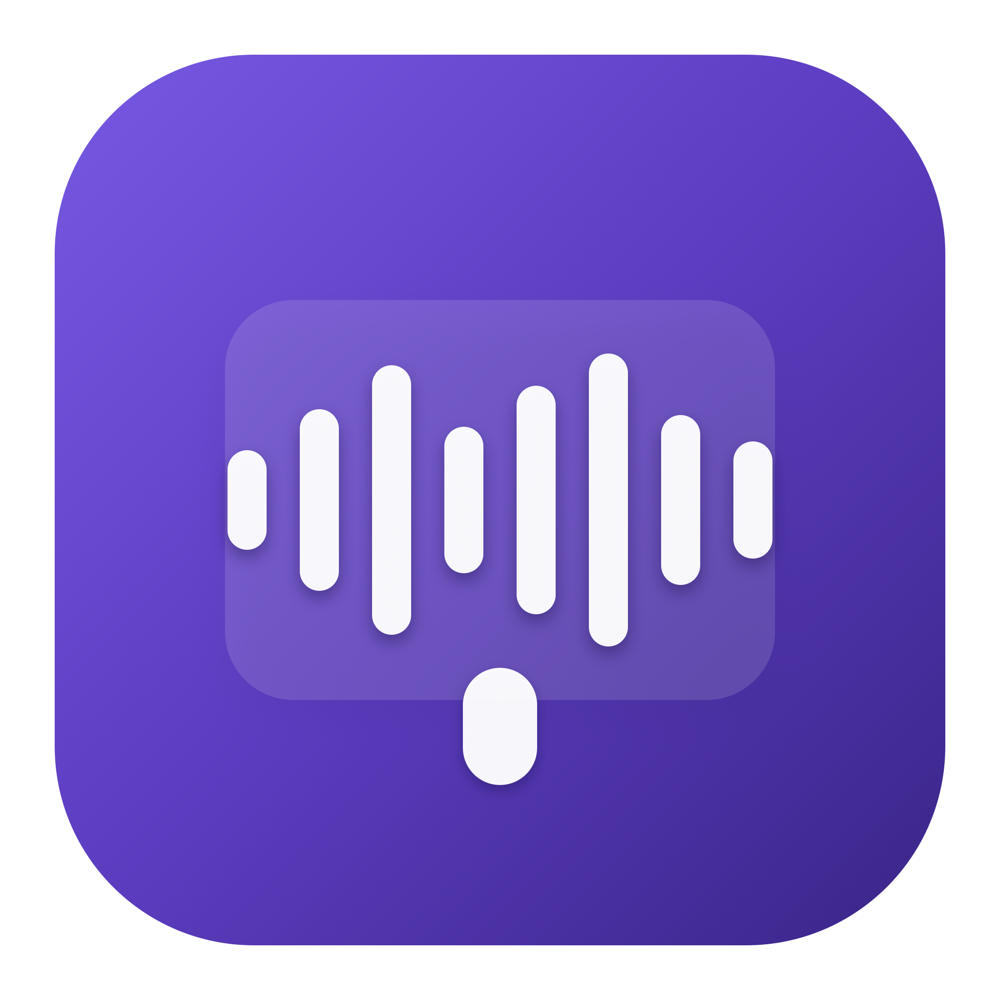

<div align="center">



# BlaBlaSpy Pro Plus 3000

### Enregistre, transcrit et résume tes réunions — en local, sur ton Mac.

[**🌐 Site**](https://sandrophoto.github.io/blablaspy/) &nbsp;·&nbsp; [**⬇ Télécharger**](https://github.com/sandrophoto/blablaspy/releases/latest) &nbsp;·&nbsp; [✉️ Contact](mailto:sandro@tigre.paris)

macOS 14+ · Apple Silicon · 100% local · mises à jour automatiques

</div>

---

BlaBlaSpy enregistre tes réunions **Teams**, **Google Meet** ou **Zoom**, les transcrit
sur ton Mac, puis génère un **compte-rendu PDF** clair : résumé, points abordés,
décisions prises et actions à mener.

## ✨ Fonctions

- 🎙️ **Capture 2 pistes** — son des participants (système) + ta voix (micro), captés
  séparément (compatible clamshell / casque / interface audio).
- ⚡ **Transcription locale** — [WhisperKit](https://github.com/argmaxinc/WhisperKit)
  sur le Neural Engine. Aucun audio envoyé sur Internet.
- 🌍 **FR · EN · Automatique** — détection de langue par piste (bilingue géré).
- 🧠 **Résumé au choix** — Apple Intelligence (gratuit, local), Claude ou ChatGPT.
- 📄 **Exports** — compte-rendu PDF, transcription `.txt`, audio mixé `.m4a`.
- 🔄 **Mises à jour automatiques** — via [Sparkle](https://sparkle-project.org), servies depuis les Releases GitHub.

## 🚀 Installation

1. Télécharge la dernière version : [Releases](https://github.com/sandrophoto/blablaspy/releases/latest).
2. Décompresse, place l'app dans **Applications**.
3. Au **premier** lancement (app non notarisée) : **clic droit → Ouvrir**.
4. Autorise **Micro** puis **Enregistrement de l'écran et du son**, et **relance** l'app.

## 🔒 Confidentialité

La transcription est 100% locale. Avec le résumé **Apple Intelligence**, rien ne quitte
ta machine. Préviens les participant·es : l'enregistrement se fait avec leur accord.

## 🧰 Technologies

SwiftUI · ScreenCaptureKit · AVFoundation · WhisperKit · Apple Intelligence · Sparkle.

## 🛠️ Build (développeurs)

```bash
./make_app.sh release      # construit dist/BlaBlaSpy Pro Plus 3000.app
./publish.sh 1.x           # build + release GitHub + appcast (Sparkle)
```

<div align="center"><sub>© 2026 STUPID STUDIO — Des apps macOS qui font une chose, très bien.</sub></div>
